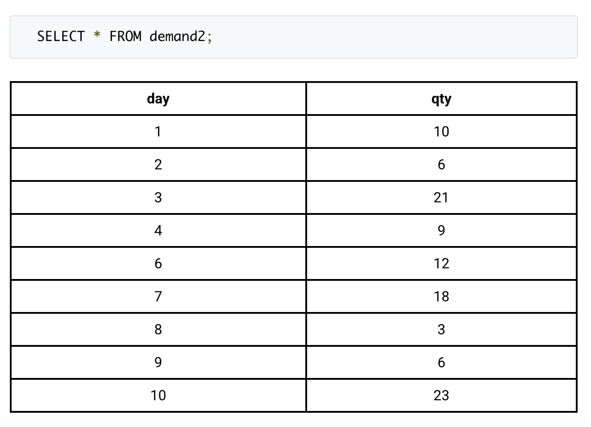
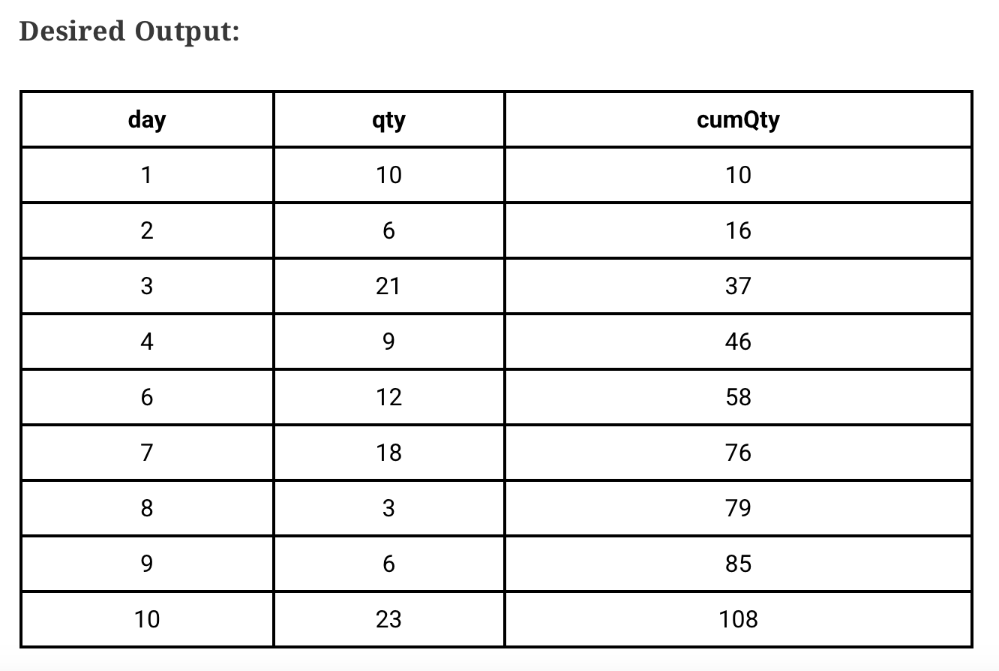
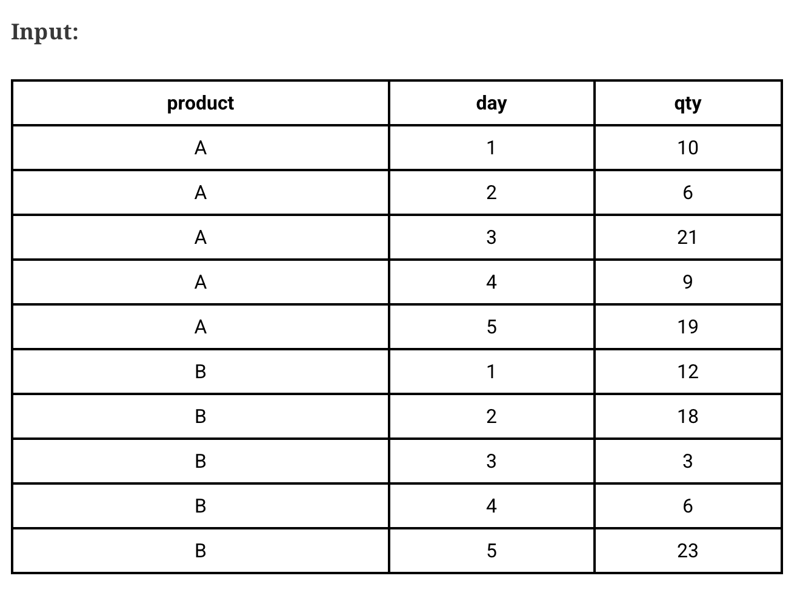
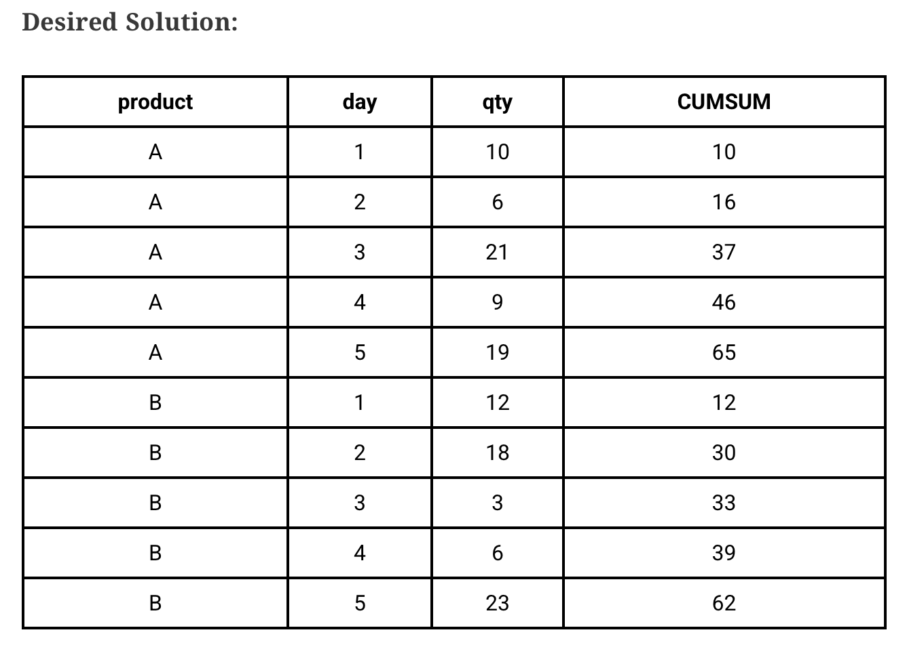

# Window Functions - Exercise Answers

These are answers containing my rationales and explanations for exercise materials from Machine Learning Plus and other websites for my own use, which may contain answers different from the official ones.

# [Machine Learning Plus](https://www.machinelearningplus.com/sql/sql-window-functions-exercises/)

## Q1. Find the running cumulative total demand

**Task:**

From the `demand2` table, find the cumulative total sum for `qty`.




### Solution:
```sql
SELECT day, qty, SUM(qty) OVER (ORDER BY day ASC) AS cumQty FROM demand2
```

There is no need to use PARTITION BY clause, as we are not dealing with a grouped dataset. We can simply use ORDER BY on its own.

## Q2. Find the running cumulative total demand by product.

**Task:**

From the `demand` table, find the cumulative total sum for `qty` for each `product` category.




### Solution:
```sql
SELECT product, day, qty SUM(qty) OVER (PARTITION BY product ORDER BY day ASC) AS 'CUMSUM' FROM demand
```

In contrast to Q1, we will be using `PARTITION BY` as there is a clear grouping, and the desired solution seeks grouping under the `product` column. Bear in mind that we are looking for cumulative sum, and we can leverage `ORDER BY` as-is in this situation, since the framing boundary for such situations defaults to `RANGE BETWEEN UNBOUNDED PRECEDING AND CURRENT ROW`, which is cumulative in nature.

## Q3. When are the top 2 worst performing days for each product?

**Task:**

Extract the two worst performing days of each `product` in terms of number of `qty` sold. Paraphrasing it: Get the days corresponding to the two minimum most values of `qty` for each `product`.

Solution:

```sql
SELECT product, day, qty, RN FROM ((SELECT product, day, qty, ROW_NUMBER() OVER (PARTITION BY product ORDER BY qty ASC) AS RN FROM demand)) T WHERE RN < 3
```

The hint is already obvious as per proposed solutiion - we are finding the two worst performing days for each product - ranked by minimum quantity per day for each product group. We can rank by using row_number(), then partitioning the product group and enforcing ascending order for the quantity so that we get the least quantity for the first 2 rows.

## Q4. Find the percentage increase in `qty` compared to the previous day.

**Task:**

Sort the table by `qty` for each product and compute the percentage increase (or decrease) compared to the previous day.

### Solution:
```sql
WITH lag_table AS (SELECT product, day, qty, LAG(qty) OVER (PARTITION BY product ORDER BY day ASC) as qty_lag FROM demand)

SELECT *, ROUND(((qty-qty_lag)/qty_lag * 100), 2) AS perc_increase FROM lag_table WHERE qty_lag is not null;
```

*Under construction*

## Q5. Show the minimum and maximum ‘qty’ sold for each product as separate columns.

**Task:**

Sort the table by `qty` for each product and compute the percentage increase (or decrease) compared to the previous day.

### Solution:
```sql
SELECT product,day,qty,MIN(qty) OVER (PARTITION BY product) as min_qty, MAX(qty) OVER (PARTITION BY product) as max_qty FROM demand;
```

*Under construction*

## Q6. Calculate the difference between the second largest and the second smallest sales qty.

**Task:**

Calculate the diffence between the second largest and the second smallest sales qty for each product.

### Solution:
```sql
WITH rn_table AS (SELECT product,day,qty,row_number() OVER (PARTITION BY product ORDER BY qty ASC) AS rn, COUNT(*) OVER (PARTITION BY product) AS row_count  FROM demand), diff_table AS (
SELECT product,day,qty,lag(qty) OVER (PARTITION BY product) AS lag_qty, lead(qty) OVER (PARTITION BY product) AS lead_qty FROM rn_table WHERE rn=2 OR (rn=row_count-1)
)

SELECT product,day,qty, ABS(qty - COALESCE(lag_qty,lead_qty))
AS diff FROM diff_table;
```

I went overkill for this one, simply because the original article did not provide the proposed solution with diff column. *Under construction*

## Q7. On each day, which product had the highest sales?

**Task:**

Create a table to show the `day` and the names of the product the the highest `qty` sale.

### Solution:
```sql
WITH rn_table as (
SELECT product, day, qty, ROW_NUMBER() OVER (PARTITION BY DAY ORDER BY QTY DESC) as rn FROM demand)

SELECT day, product, qty from rn_table where rn=1;
```

P.S. - the max_qty column in the desired solution is redundant. Ranking helps tremendously.

## Q8. Create row numbers in increasing order of sales.

**Task:**

Create row numbers in increasing order of `sales`, starting with 1 in each location

### Solution:
```sql
SELECT product, location, sales, refunds, ROW_NUMBER() over (partition by location order by sales asc) as rn from demand;
```